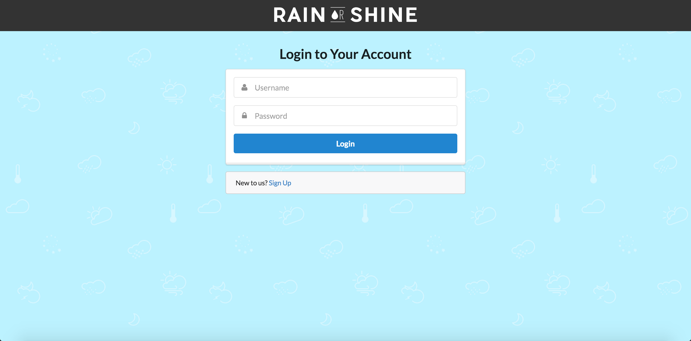
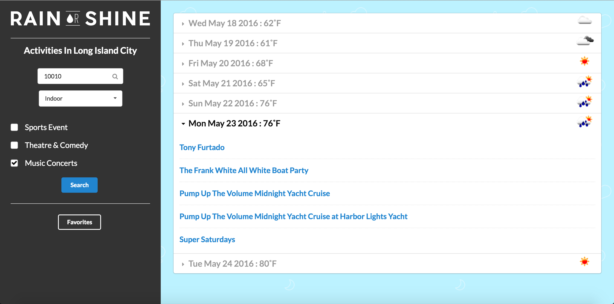
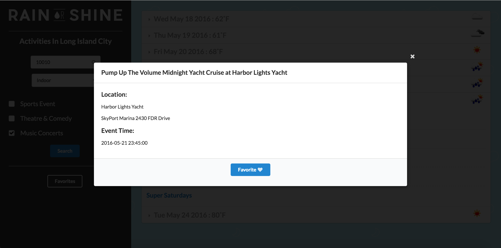

**Rain or Shine**  
  
**About**  
Are you ever stumped with what to do with your weekend when the weather gets in your way?
Do you like to plan your activities in tune with the weather man's predictions?
Rain or Shine allows you to search for both indoor and outdoor activities depending
on the latest weather forecast. Whether it be a sports event, theater or comedy shows
or concerts, Rain or Shine will tell you what's going on when so you aren't
caught by surprise!
  
**Technology**  
The site uses Express, node.js, MongoDB and Javascript with the jwt passport as authentication.
For the data pulled, it makes use of the Openweather api as well as the Seatgeek and eventful apis.
  
**User Stories**  
As a user, I want to use the weather forecast to filter indoor and outdoor activities
in my area so I can optimally plan. Additionally, I want to save or "favorite"
some of my preferred events to my user profile.
  
**Screenshots**  
What the user will see at the log in page:  
  
  
The main page before a search:  
  
  
The search results:  

Event Details:  

